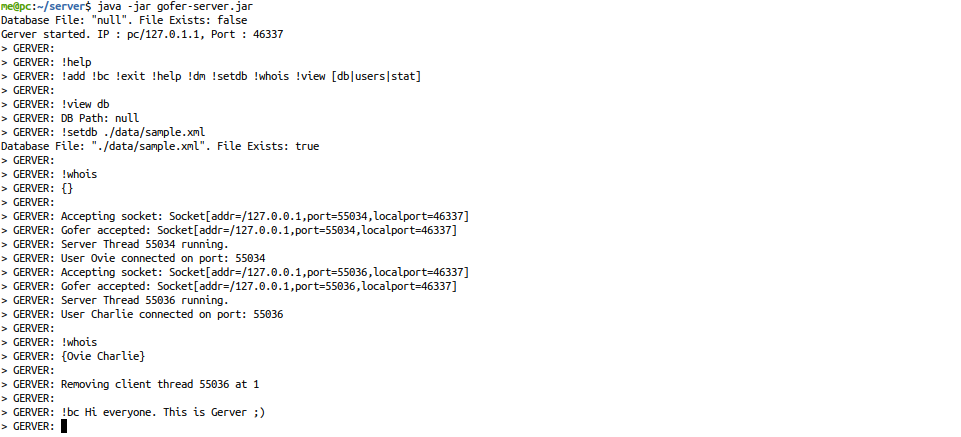

# gofer-server

The server for gofer project, a client-server chat system built with Java.

## Dependency
See pom.xml file

## How To Build
Use maven

## Todo
- Proper message encryption layer
- Improve multi-threading

## Screenshot

